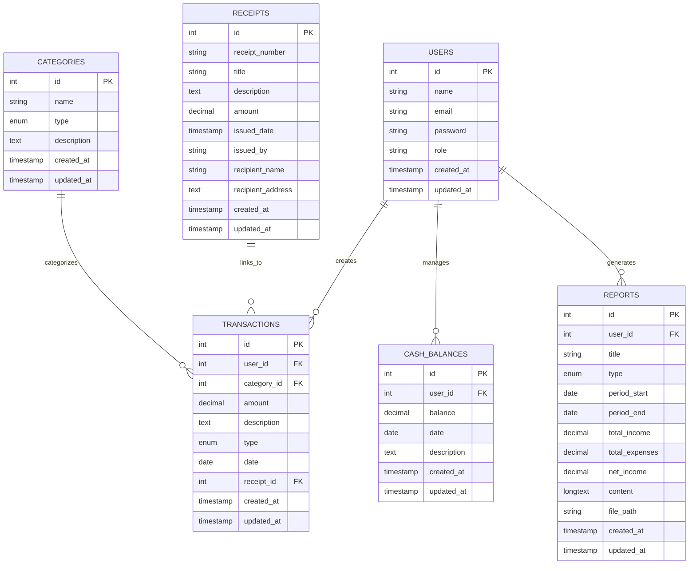

## About Laravel

Laravel is a web application framework with expressive, elegant syntax. We believe development must be an enjoyable and creative experience to be truly fulfilling. Laravel takes the pain out of development by easing common tasks used in many web projects, such as:

- [Simple, fast routing engine](https://laravel.com/docs/routing).
- [Powerful dependency injection container](https://laravel.com/docs/container).
- Multiple back-ends for [session](https://laravel.com/docs/session) and [cache](https://laravel.com/docs/cache) storage.
- Expressive, intuitive [database ORM](https://laravel.com/docs/eloquent).
- Database agnostic [schema migrations](https://laravel.com/docs/migrations).
- [Robust background job processing](https://laravel.com/docs/queues).
- [Real-time event broadcasting](https://laravel.com/docs/broadcasting).

Laravel is accessible, powerful, and provides tools required for large, robust applications.

## Learning Laravel

Laravel has the most extensive and thorough [documentation](https://laravel.com/docs) and video tutorial library of all modern web application frameworks, making it a breeze to get started with the framework.

You may also try the [Laravel Bootcamp](https://bootcamp.laravel.com), where you will be guided through building a modern Laravel application from scratch.

If you don't feel like reading, [Laracasts](https://laracasts.com) can help. Laracasts contains thousands of video tutorials on a range of topics including Laravel, modern PHP, unit testing, and JavaScript. Boost your skills by digging into our comprehensive video library.

## Laravel Sponsors

We would like to extend our thanks to the following sponsors for funding Laravel development. If you are interested in becoming a sponsor, please visit the [Laravel Partners program](https://partners.laravel.com).

### Premium Partners

- **[Vehikl](https://vehikl.com)**
- **[Tighten Co.](https://tighten.co)**
- **[Kirschbaum Development Group](https://kirschbaumdevelopment.com)**
- **[64 Robots](https://64robots.com)**
- **[Curotec](https://www.curotec.com/services/technologies/laravel)**
- **[DevSquad](https://devsquad.com/hire-laravel-developers)**
- **[Redberry](https://redberry.international/laravel-development)**
- **[Active Logic](https://activelogic.com)**

## Contributing

Thank you for considering contributing to the Laravel framework! The contribution guide can be found in the [Laravel documentation](https://laravel.com/docs/contributions).

## Code of Conduct

In order to ensure that the Laravel community is welcoming to all, please review and abide by the [Code of Conduct](https://laravel.com/docs/contributions#code-of-conduct).

## Security Vulnerabilities

If you discover a security vulnerability within Laravel, please send an e-mail to Taylor Otwell via [taylor@laravel.com](mailto:taylor@laravel.com). All security vulnerabilities will be promptly addressed.

## Database Schema

This project implements a Financial Information System using Laravel's Eloquent ORM to manage financial transactions and reporting.

### Entity Relationship Diagram (ERD)

### Database Tables

#### 1. users table
| Column | Type | Description |
|--------|------|-------------|
| id | int (PK) | Primary key |
| name | string | User's full name |
| email | string | User's email address (unique) |
| password | string | Hashed password |
| role | enum | User role: 'admin', 'bendahara', 'auditor' |
| created_at | timestamp | Record creation time |
| updated_at | timestamp | Record update time |

#### 2. categories table
| Column | Type | Description |
|--------|------|-------------|
| id | int (PK) | Primary key |
| name | string | Category name (e.g., "Pendapatan Usaha", "Biaya Operasional") |
| type | enum | Type: 'income' or 'expense' |
| description | text | Description of the category |
| created_at | timestamp | Record creation time |
| updated_at | timestamp | Record update time |

#### 3. transactions table
| Column | Type | Description |
|--------|------|-------------|
| id | int (PK) | Primary key |
| user_id | int (FK) | Foreign key to users table |
| category_id | int (FK) | Foreign key to categories table |
| amount | decimal(15,2) | Transaction amount |
| description | text | Description of the transaction |
| type | enum | Type: 'income' or 'expense' |
| date | date | Date of the transaction |
| receipt_id | int (FK) | Foreign key to receipts table (nullable) |
| created_at | timestamp | Record creation time |
| updated_at | timestamp | Record update time |

#### 4. receipts table
| Column | Type | Description |
|--------|------|-------------|
| id | int (PK) | Primary key |
| receipt_number | string (unique) | Unique receipt number |
| title | string | Title of the receipt |
| description | text | Description of the receipt |
| amount | decimal(15,2) | Amount on the receipt |
| issued_date | timestamp | Date when receipt was issued |
| issued_by | string | Name of person who issued receipt |
| recipient_name | string | Name of recipient |
| recipient_address | text | Address of recipient |
| created_at | timestamp | Record creation time |
| updated_at | timestamp | Record update time |

#### 5. cash_balances table
| Column | Type | Description |
|--------|------|-------------|
| id | int (PK) | Primary key |
| user_id | int (FK) | Foreign key to users table |
| balance | decimal(15,2) | Current cash balance |
| date | date | Date of the balance record |
| description | text | Description of the balance entry |
| created_at | timestamp | Record creation time |
| updated_at | timestamp | Record update time |

#### 6. reports table
| Column | Type | Description |
|--------|------|-------------|
| id | int (PK) | Primary key |
| user_id | int (FK) | Foreign key to users table |
| title | string | Title of the report |
| type | enum | Type: 'monthly', 'quarterly', 'annual' |
| period_start | date | Start date of reporting period |
| period_end | date | End date of reporting period |
| total_income | decimal(15,2) | Total income during period |
| total_expenses | decimal(15,2) | Total expenses during period |
| net_income | decimal(15,2) | Net income (total income - total expenses) |
| content | longtext | Detailed content of the report |
| file_path | string | Path to report file (nullable) |
| created_at | timestamp | Record creation time |
| updated_at | timestamp | Record update time |

## Features Implemented

1. **Financial Transaction Recording**: 
   - Income and expense recording with categorization
   - Date tracking and descriptions
   - User attribution

2. **Monthly Financial Reports**:
   - Automated calculation of income, expenses, and net income
   - Time period specification
   - Detailed content and file attachment options

3. **Digital Receipts**:
   - Unique receipt numbers
   - Issuer and recipient information
   - Amount tracking

4. **Cash Balance Monitoring**:
   - Real-time cash balance tracking
   - Historical balance records
   - Date-specific balance tracking

5. **Role-based Access Control**:
   - Admin Keuangan: Full access to all features
   - Bendahara: Transaction recording and basic reporting
   - Auditor: Read-only access for auditing purposes

## License

The Laravel framework is open-sourced software licensed under the [MIT license](https://opensource.org/licenses/MIT).
