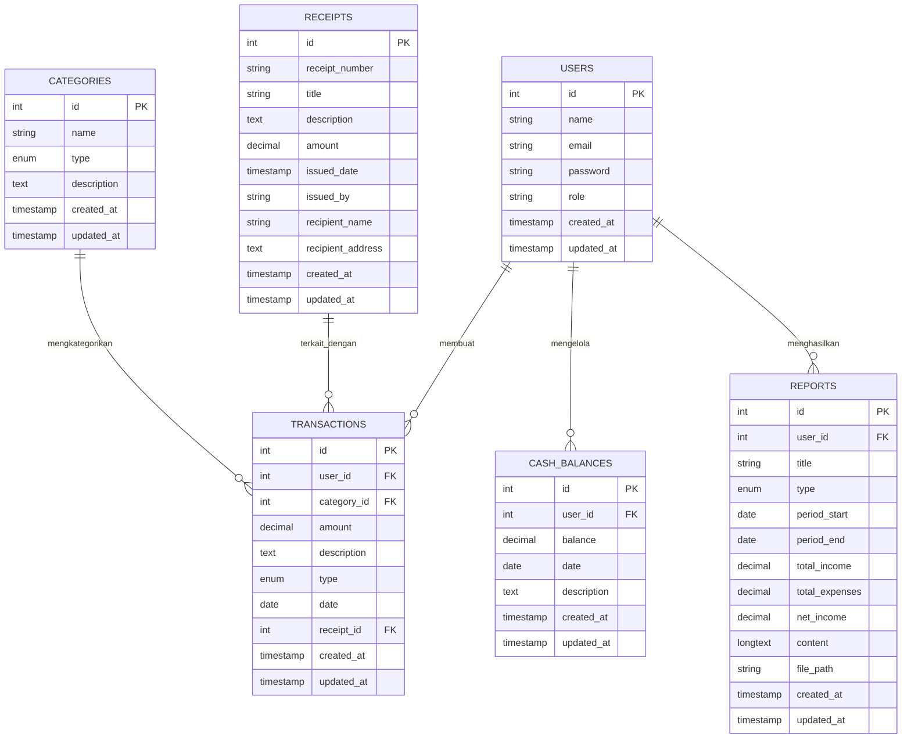

## Tentang Laravel

Laravel adalah framework aplikasi web dengan sintaks yang ekspresif dan elegan. Kami percaya pengembangan harus menjadi pengalaman yang menyenangkan dan kreatif agar benar-benar memuaskan. Laravel menghilangkan rasa sakit pengembangan dengan memudahkan tugas umum yang digunakan dalam banyak proyek web, seperti:

- [Mesin routing yang sederhana dan cepat](https://laravel.com/docs/routing).
- [Kontainer dependency injection yang kuat](https://laravel.com/docs/container).
- Beberapa backend untuk penyimpanan [session](https://laravel.com/docs/session) dan [cache](https://laravel.com/docs/cache).
- [ORM database yang ekspresif dan intuitif](https://laravel.com/docs/eloquent).
- [Migrasi skema database yang tidak bergantung pada database](https://laravel.com/docs/migrations).
- [Pemrosesan tugas latar belakang yang kuat](https://laravel.com/docs/queues).
- [Broadcasting event secara real-time](https://laravel.com/docs/broadcasting).

Laravel mudah diakses, kuat, dan menyediakan alat yang diperlukan untuk aplikasi besar dan kuat.

## Belajar Laravel

Laravel memiliki dokumentasi dan perpustakaan tutorial video terlengkap dan paling menyeluruh di antara semua framework aplikasi web modern, menjadikannya mudah untuk memulai dengan framework ini.

Anda juga dapat mencoba [Laravel Bootcamp](https://bootcamp.laravel.com), di mana Anda akan dipandu membangun aplikasi Laravel modern dari awal.

Jika Anda tidak ingin membaca, [Laracasts](https://laracasts.com) dapat membantu. Laracasts berisi ribuan tutorial video tentang berbagai topik termasuk Laravel, PHP modern, pengujian unit, dan JavaScript. Tingkatkan keterampilan Anda dengan menggali perpustakaan video komprehensif kami.

## Sponsor Laravel

Kami ingin menyampaikan terima kasih kepada sponsor berikut yang mendanai pengembangan Laravel. Jika Anda tertarik menjadi sponsor, silakan kunjungi [program Laravel Partners](https://partners.laravel.com).

### Sponsor Premium

- **[Vehikl](https://vehikl.com)**
- **[Tighten Co.](https://tighten.co)**
- **[Kirschbaum Development Group](https://kirschbaumdevelopment.com)**
- **[64 Robots](https://64robots.com)**
- **[Curotec](https://www.curotec.com/services/technologies/laravel)**
- **[DevSquad](https://devsquad.com/hire-laravel-developers)**
- **[Redberry](https://redberry.international/laravel-development)**
- **[Active Logic](https://activelogic.com)**

## Berkontribusi

Terima kasih telah mempertimbangkan untuk berkontribusi pada framework Laravel! Panduan kontribusi dapat ditemukan di [dokumentasi Laravel](https://laravel.com/docs/contributions).

## Kode Etik

Untuk memastikan komunitas Laravel menyambut semua orang, silakan tinjau dan patuhi [Kode Etik](https://laravel.com/docs/contributions#code-of-conduct).

## Kerentanan Keamanan

Jika Anda menemukan kerentanan keamanan dalam Laravel, silakan kirim email ke Taylor Otwell melalui [taylor@laravel.com](mailto:taylor@laravel.com). Semua kerentanan keamanan akan segera ditangani.

## Skema Database

Proyek ini mengimplementasikan Sistem Informasi Keuangan menggunakan Eloquent ORM Laravel untuk mengelola transaksi keuangan dan pelaporan.

### Diagram Entitas Relasi (ERD)

### Tabel Database

#### 1. Tabel users
| Kolom | Tipe | Deskripsi |
|--------|------|-------------|
| id | int (PK) | Primary key |
| name | string | Nama lengkap pengguna |
| email | string | Alamat email pengguna (unik) |
| password | string | Kata sandi yang di-hash |
| role | enum | Peran pengguna: 'admin', 'bendahara', 'auditor', 'guest' |
| created_at | timestamp | Waktu pembuatan record |
| updated_at | timestamp | Waktu pembaruan record |

#### 2. Tabel categories
| Kolom | Tipe | Deskripsi |
|--------|------|-------------|
| id | int (PK) | Primary key |
| name | string | Nama kategori (misalnya "Pendapatan Usaha", "Biaya Operasional") |
| type | enum | Jenis: 'income' atau 'expense' |
| description | text | Deskripsi kategori |
| created_at | timestamp | Waktu pembuatan record |
| updated_at | timestamp | Waktu pembaruan record |

#### 3. Tabel transactions
| Kolom | Tipe | Deskripsi |
|--------|------|-------------|
| id | int (PK) | Primary key |
| user_id | int (FK) | Foreign key ke tabel users |
| category_id | int (FK) | Foreign key ke tabel categories |
| amount | decimal(15,2) | Jumlah transaksi |
| description | text | Deskripsi transaksi |
| type | enum | Jenis: 'income' atau 'expense' |
| date | date | Tanggal transaksi |
| receipt_id | int (FK) | Foreign key ke tabel receipts (dapat null) |
| created_at | timestamp | Waktu pembuatan record |
| updated_at | timestamp | Waktu pembaruan record |

#### 4. Tabel receipts
| Kolom | Tipe | Deskripsi |
|--------|------|-------------|
| id | int (PK) | Primary key |
| receipt_number | string (unik) | Nomor kwitansi unik |
| title | string | Judul kwitansi |
| description | text | Deskripsi kwitansi |
| amount | decimal(15,2) | Jumlah pada kwitansi |
| issued_date | timestamp | Tanggal kwitansi dikeluarkan |
| issued_by | string | Nama orang yang mengeluarkan kwitansi |
| recipient_name | string | Nama penerima |
| recipient_address | text | Alamat penerima |
| created_at | timestamp | Waktu pembuatan record |
| updated_at | timestamp | Waktu pembaruan record |

#### 5. Tabel cash_balances
| Kolom | Tipe | Deskripsi |
|--------|------|-------------|
| id | int (PK) | Primary key |
| user_id | int (FK) | Foreign key ke tabel users |
| balance | decimal(15,2) | Saldo kas saat ini |
| date | date | Tanggal catatan saldo |
| description | text | Deskripsi entri saldo |
| created_at | timestamp | Waktu pembuatan record |
| updated_at | timestamp | Waktu pembaruan record |

#### 6. Tabel reports
| Kolom | Tipe | Deskripsi |
|--------|------|-------------|
| id | int (PK) | Primary key |
| user_id | int (FK) | Foreign key ke tabel users |
| title | string | Judul laporan |
| type | enum | Jenis: 'monthly', 'quarterly', 'annual' |
| period_start | date | Tanggal awal periode pelaporan |
| period_end | date | Tanggal akhir periode pelaporan |
| total_income | decimal(15,2) | Total pendapatan selama periode |
| total_expenses | decimal(15,2) | Total pengeluaran selama periode |
| net_income | decimal(15,2) | Pendapatan bersih (total pendapatan - total pengeluaran) |
| content | longtext | Konten terperinci laporan |
| file_path | string | Jalur ke file laporan (dapat null) |
| created_at | timestamp | Waktu pembuatan record |
| updated_at | timestamp | Waktu pembaruan record |

## Hak Akses Berdasarkan Peran Pengguna

Sistem ini menerapkan kontrol akses berbasis peran (Role-Based Access Control/RBAC) untuk memastikan keamanan dan pembagian tugas yang tepat. Berikut adalah penjelasan hak akses masing-masing peran berdasarkan middleware dan rute yang didefinisikan:

### 1. Admin
Peran admin memiliki akses penuh ke semua fitur eksklusif admin dan bertanggung jawab atas manajemen sistem secara keseluruhan.

**Hak Akses Admin:**
- Melihat dashboard admin (`/admin/dashboard`)
- Mengelola pengguna (melihat daftar pengguna, mengatur peran pengguna) (`/admin/users`, `/admin/users-management`, `/admin/users/{id}/role`)
- Mengakses semua data transaksi, laporan, dan saldo kas melalui rute admin
- Membaca, membuat, mengedit, dan menghapus transaksi (`/admin/transactions`)
- Membaca, membuat, mengedit, dan menghapus laporan (`/admin/reports`)
- Membaca, membuat, mengedit, dan menghapus kwitansi (`/admin/receipts`)
- Membaca, membuat, mengedit, dan menghapus saldo kas (`/admin/cash-balances`)
- Menghasilkan laporan bulanan khusus admin (`/admin/reports/monthly`)

### 2. Bendahara
Peran bendahara memiliki akses ke fitur-fitur pencatatan dan pengelolaan keuangan melalui rute khusus bendahara.

**Hak Akses Bendahara:**
- Melihat dashboard bendahara (`/bendahara/dashboard`)
- Membaca, membuat, mengedit, dan menghapus transaksi (`/bendahara/transactions`)
- Membaca, membuat, mengedit, dan menghapus laporan (`/bendahara/reports`)
- Membaca, membuat, mengedit, dan menghapus kwitansi (`/bendahara/receipts`)
- Membaca, membuat, mengedit, dan menghapus saldo kas (`/bendahara/cash-balances`)
- Memantau saldo kas (`/bendahara/cash-balances/monitor`)
- Menghasilkan laporan bulanan (`/bendahara/reports/monthly`)
- Membuat kwitansi dari transaksi (`/bendahara/transactions/{transaction}/receipt`)
- Melihat cetak kwitansi (`/bendahara/receipts/{receipt}/print`)

### 3. Auditor
Peran auditor memiliki akses ke fitur-fitur khusus auditor untuk kepentingan audit dan verifikasi data keuangan.

**Hak Akses Auditor:**
- Melihat dashboard auditor (`/auditor/dashboard`)
- Membaca, membuat, mengedit, dan menghapus laporan auditor (`/auditor/reports`)
- Menghasilkan laporan bulanan khusus auditor (`/auditor/reports/monthly`)

### 4. Akses Bersama
Beberapa fitur dapat diakses oleh lebih dari satu peran berdasarkan middleware:

**Akses untuk Bendahara, Admin, dan Auditor:**
- Fitur-fitur yang dilindungi middleware `['auth', 'role-check', 'role:bendahara|admin|auditor ']` dapat diakses oleh ketiga peran ini, termasuk rute-rute di bawah `/bendahara/` seperti transaksi, laporan, kwitansi, dan saldo kas.

**Akses untuk Semua Peran Terdaftar:**
- Fitur-fitur yang dilindungi middleware `['auth', 'role-check']` dapat diakses oleh semua peran yang terdaftar (admin, bendahara, auditor) untuk fitur umum seperti profil pengguna.

## Fitur yang Diimplementasikan

1. **Pencatatan Transaksi Keuangan**:
   - [x] Pencatatan pendapatan dan pengeluaran dengan pengkategorian
   - [x] Pelacakan tanggal dan deskripsi
   - [x] Atribusi pengguna

2. **Laporan Keuangan Bulanan**:
   - [x] Perhitungan otomatis pendapatan, pengeluaran, dan pendapatan bersih
   - [x] Spesifikasi periode waktu
   - [x] Opsi konten terperinci dan lampiran file

3. **Kwitansi Digital**:
   - [x] Nomor kwitansi unik
   - [x] Informasi penerbit dan penerima
   - [x] Pelacakan jumlah

4. **Pemantauan Saldo Kas**:
   - [x] Pemantauan saldo kas secara real-time
   - [x] Catatan riwayat saldo
   - [x] Pelacakan saldo berdasarkan tanggal

5. **Kontrol Akses Berbasis Peran**:
   - [x] Admin Keuangan: Akses penuh ke semua fitur
   - [x] Bendahara: Pencatatan transaksi dan pelaporan dasar
   - [x] Auditor: Akses hanya baca untuk keperluan audit

## Checklist Tugas Tim

- [x] Membuat skema database untuk sistem informasi keuangan
- [x] Mengimplementasikan model Eloquent untuk setiap tabel
- [x] Membuat migration untuk setiap tabel
- [x] Membuat dan menguji relasi antar model
- [x] Membuat seeder untuk data awal
- [x] Menambahkan dokumentasi ERD menggunakan Mermaid.js
- [x] Menambahkan dokumentasi tabel database
- [x] Menambahkan daftar checklist tugas tim
- [x] Implementasi antarmuka pengguna (UI)
- [x] Implementasi sistem otentikasi dan otorisasi
- [x] Implementasi fitur pencatatan transaksi
- [x] Implementasi fitur laporan keuangan
- [x] Implementasi fitur cetak kwitansi
- [x] Implementasi fitur monitoring saldo kas
- [x] Uji coba dan debugging
- [x] Deployment aplikasi

## Lisensi

Framework Laravel adalah perangkat lunak open-source yang dilisensikan di bawah [lisensi MIT](https://opensource.org/licenses/MIT).
