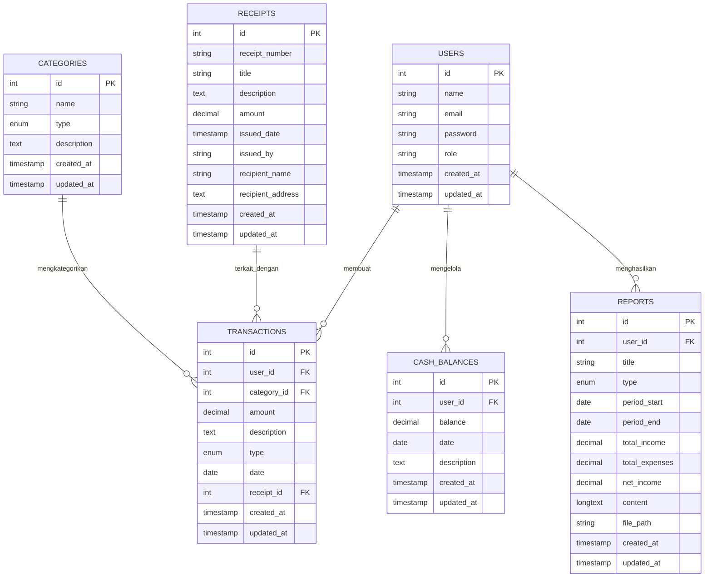

## About Laravel

Laravel is a web application framework with expressive, elegant syntax. We believe development must be an enjoyable and creative experience to be truly fulfilling. Laravel takes the pain out of development by easing common tasks used in many web projects, such as:

- [Simple, fast routing engine](https://laravel.com/docs/routing).
- [Powerful dependency injection container](https://laravel.com/docs/container).
- Multiple back-ends for [session](https://laravel.com/docs/session) and [cache](https://laravel.com/docs/cache) storage.
- Expressive, intuitive [database ORM](https://laravel.com/docs/eloquent).
- Database agnostic [schema migrations](https://laravel.com/docs/migrations).
- [Robust background job processing](https://laravel.com/docs/queues).
- [Real-time event broadcasting](https://laravel.com/docs/broadcasting).

Laravel is accessible, powerful, and provides tools required for large, robust applications.

## Learning Laravel

Laravel has the most extensive and thorough [documentation](https://laravel.com/docs) and video tutorial library of all modern web application frameworks, making it a breeze to get started with the framework.

You may also try the [Laravel Bootcamp](https://bootcamp.laravel.com), where you will be guided through building a modern Laravel application from scratch.

If you don't feel like reading, [Laracasts](https://laracasts.com) can help. Laracasts contains thousands of video tutorials on a range of topics including Laravel, modern PHP, unit testing, and JavaScript. Boost your skills by digging into our comprehensive video library.

## Laravel Sponsors

We would like to extend our thanks to the following sponsors for funding Laravel development. If you are interested in becoming a sponsor, please visit the [Laravel Partners program](https://partners.laravel.com).

### Premium Partners

- **[Vehikl](https://vehikl.com)**
- **[Tighten Co.](https://tighten.co)**
- **[Kirschbaum Development Group](https://kirschbaumdevelopment.com)**
- **[64 Robots](https://64robots.com)**
- **[Curotec](https://www.curotec.com/services/technologies/laravel)**
- **[DevSquad](https://devsquad.com/hire-laravel-developers)**
- **[Redberry](https://redberry.international/laravel-development)**
- **[Active Logic](https://activelogic.com)**

## Contributing

Thank you for considering contributing to the Laravel framework! The contribution guide can be found in the [Laravel documentation](https://laravel.com/docs/contributions).

## Code of Conduct

In order to ensure that the Laravel community is welcoming to all, please review and abide by the [Code of Conduct](https://laravel.com/docs/contributions#code-of-conduct).

## Security Vulnerabilities

If you discover a security vulnerability within Laravel, please send an e-mail to Taylor Otwell via [taylor@laravel.com](mailto:taylor@laravel.com). All security vulnerabilities will be promptly addressed.

## Skema Database

Proyek ini mengimplementasikan Sistem Informasi Keuangan menggunakan Eloquent ORM Laravel untuk mengelola transaksi keuangan dan pelaporan.

### Diagram Entitas Relasi (ERD)

### Tabel Database

#### 1. Tabel users
| Kolom | Tipe | Deskripsi |
|--------|------|-------------|
| id | int (PK) | Primary key |
| name | string | Nama lengkap pengguna |
| email | string | Alamat email pengguna (unik) |
| password | string | Kata sandi yang di-hash |
| role | enum | Peran pengguna: 'admin', 'bendahara', 'auditor' |
| created_at | timestamp | Waktu pembuatan record |
| updated_at | timestamp | Waktu pembaruan record |

#### 2. Tabel categories
| Kolom | Tipe | Deskripsi |
|--------|------|-------------|
| id | int (PK) | Primary key |
| name | string | Nama kategori (misalnya "Pendapatan Usaha", "Biaya Operasional") |
| type | enum | Jenis: 'income' atau 'expense' |
| description | text | Deskripsi kategori |
| created_at | timestamp | Waktu pembuatan record |
| updated_at | timestamp | Waktu pembaruan record |

#### 3. Tabel transactions
| Kolom | Tipe | Deskripsi |
|--------|------|-------------|
| id | int (PK) | Primary key |
| user_id | int (FK) | Foreign key ke tabel users |
| category_id | int (FK) | Foreign key ke tabel categories |
| amount | decimal(15,2) | Jumlah transaksi |
| description | text | Deskripsi transaksi |
| type | enum | Jenis: 'income' atau 'expense' |
| date | date | Tanggal transaksi |
| receipt_id | int (FK) | Foreign key ke tabel receipts (dapat null) |
| created_at | timestamp | Waktu pembuatan record |
| updated_at | timestamp | Waktu pembaruan record |

#### 4. Tabel receipts
| Kolom | Tipe | Deskripsi |
|--------|------|-------------|
| id | int (PK) | Primary key |
| receipt_number | string (unik) | Nomor kwitansi unik |
| title | string | Judul kwitansi |
| description | text | Deskripsi kwitansi |
| amount | decimal(15,2) | Jumlah pada kwitansi |
| issued_date | timestamp | Tanggal kwitansi dikeluarkan |
| issued_by | string | Nama orang yang mengeluarkan kwitansi |
| recipient_name | string | Nama penerima |
| recipient_address | text | Alamat penerima |
| created_at | timestamp | Waktu pembuatan record |
| updated_at | timestamp | Waktu pembaruan record |

#### 5. Tabel cash_balances
| Kolom | Tipe | Deskripsi |
|--------|------|-------------|
| id | int (PK) | Primary key |
| user_id | int (FK) | Foreign key ke tabel users |
| balance | decimal(15,2) | Saldo kas saat ini |
| date | date | Tanggal catatan saldo |
| description | text | Deskripsi entri saldo |
| created_at | timestamp | Waktu pembuatan record |
| updated_at | timestamp | Waktu pembaruan record |

#### 6. Tabel reports
| Kolom | Tipe | Deskripsi |
|--------|------|-------------|
| id | int (PK) | Primary key |
| user_id | int (FK) | Foreign key ke tabel users |
| title | string | Judul laporan |
| type | enum | Jenis: 'monthly', 'quarterly', 'annual' |
| period_start | date | Tanggal awal periode pelaporan |
| period_end | date | Tanggal akhir periode pelaporan |
| total_income | decimal(15,2) | Total pendapatan selama periode |
| total_expenses | decimal(15,2) | Total pengeluaran selama periode |
| net_income | decimal(15,2) | Pendapatan bersih (total pendapatan - total pengeluaran) |
| content | longtext | Konten terperinci laporan |
| file_path | string | Jalur ke file laporan (dapat null) |
| created_at | timestamp | Waktu pembuatan record |
| updated_at | timestamp | Waktu pembaruan record |

## Fitur yang Diimplementasikan

1. **Pencatatan Transaksi Keuangan**: 
   - [ ] Pencatatan pendapatan dan pengeluaran dengan pengkategorian
   - [ ] Pelacakan tanggal dan deskripsi
   - [ ] Atribusi pengguna

2. **Laporan Keuangan Bulanan**:
   - [ ] Perhitungan otomatis pendapatan, pengeluaran, dan pendapatan bersih
   - [ ] Spesifikasi periode waktu
   - [ ] Opsi konten terperinci dan lampiran file

3. **Kwitansi Digital**:
   - [ ] Nomor kwitansi unik
   - [ ] Informasi penerbit dan penerima
   - [ ] Pelacakan jumlah

4. **Pemantauan Saldo Kas**:
   - [ ] Pemantauan saldo kas secara real-time
   - [ ] Catatan riwayat saldo
   - [ ] Pelacakan saldo berdasarkan tanggal

5. **Kontrol Akses Berbasis Peran**:
   - [ ] Admin Keuangan: Akses penuh ke semua fitur
   - [ ] Bendahara: Pencatatan transaksi dan pelaporan dasar
   - [ ] Auditor: Akses hanya baca untuk keperluan audit

## Checklist Tugas Tim

- [x] Membuat skema database untuk sistem informasi keuangan
- [x] Mengimplementasikan model Eloquent untuk setiap tabel
- [x] Membuat migration untuk setiap tabel
- [x] Membuat dan menguji relasi antar model
- [x] Membuat seeder untuk data awal
- [x] Menambahkan dokumentasi ERD menggunakan Mermaid.js
- [x] Menambahkan dokumentasi tabel database
- [x] Menambahkan daftar checklist tugas tim
- [ ] Implementasi antarmuka pengguna (UI)
- [ ] Implementasi sistem otentikasi dan otorisasi
- [ ] Implementasi fitur pencatatan transaksi
- [ ] Implementasi fitur laporan keuangan
- [ ] Implementasi fitur cetak kwitansi
- [ ] Implementasi fitur monitoring saldo kas
- [ ] Uji coba dan debugging
- [ ] Deployment aplikasi

## Lisensi

Framework Laravel adalah perangkat lunak open-source yang dilisensikan di bawah [lisensi MIT](https://opensource.org/licenses/MIT).
